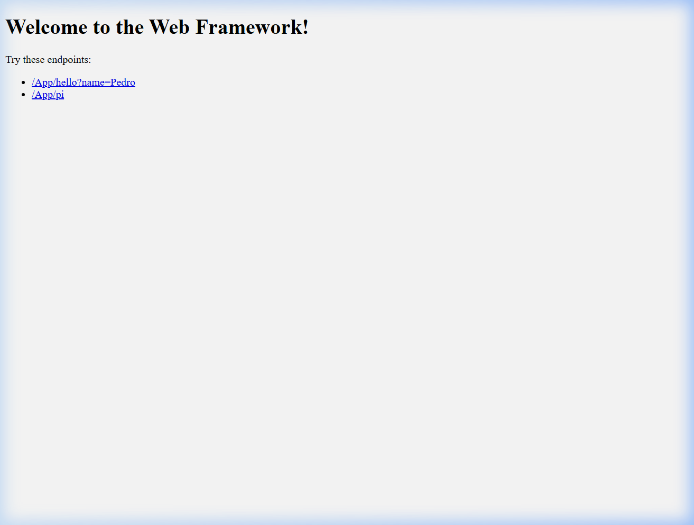

# Web Framework — REST Services & Static File Management

## Descripción

Este proyecto transforma un servidor web básico en Java en un **mini framework web** que permite a los desarrolladores construir aplicaciones con:

- **Servicios REST** definidos mediante funciones lambda (`get()`)
- **Extracción de parámetros de consulta** de las URLs (`req.getValues("key")`)
- **Servicio de archivos estáticos** (HTML, CSS, JS, imágenes) desde un directorio configurable (`staticfiles()`)

El framework no requiere dependencias externas. Está implementado únicamente con las APIs estándar de Java y construido con **Maven**.

---

## Arquitectura

```
Navegador
  │  GET /App/hello?name=Pedro
  ▼
HTTPServer  ──► Request (parsea path y query params)
  │
  ├─ ¿Ruta registrada? ──► SÍ ──► ejecuta lambda ──► Response.send()
  │
  └─ NO ──► busca archivo estático en /webroot ──► Response.sendFile()
                │
                └─ No existe ──► 404
```

### Clases principales

| Clase | Responsabilidad |
|---|---|
| `WebFramework` | Singleton central — expone `get()`, `staticfiles()`; auto-inicia el servidor en un hilo |
| `HTTPServer` | Acepta conexiones TCP, parsea la petición y delega al framework |
| `Request` | Encapsula path y query params; expone `getValues(key)` |
| `Response` | Encapsula el código de estado, Content-Type y el cuerpo de la respuesta |
| `Route` | Interfaz funcional `@FunctionalInterface` — implementada con lambdas por el desarrollador |
| `App` | Ejemplo de aplicación que usa el framework |

### Estructura del proyecto

```
webframework/
├── src/
│   ├── main/
│   │   ├── java/edu/escuelaing/arep/webframework/
│   │   │   ├── WebFramework.java       # Fachada principal del framework
│   │   │   ├── HTTPServer.java         # Servidor TCP con parseo HTTP
│   │   │   ├── Request.java            # Parseo del request y query params
│   │   │   ├── Response.java           # Construcción de respuestas HTTP
│   │   │   ├── Route.java              # Interfaz funcional para lambdas
│   │   │   └── example/
│   │   │       └── App.java            # Aplicación de ejemplo
│   │   └── resources/
│   │       └── webroot/
│   │           └── index.html          # Archivo estático de demo
│   └── test/
│       └── java/edu/escuelaing/arep/webframework/
│           └── WebFrameworkTest.java   # Tests unitarios (JUnit 4)
├── .gitignore
├── pom.xml
└── README.md
```

---

## Instalación y Ejecución

**Requisitos:** Java 11+, Maven 3.6+, Git

```bash
# 1. Clonar el repositorio
git clone https://github.com/Exael74/TDSE---Project-Statement-Web-Framework-Development-for-REST-Services-and-Static-File-Management.git
cd TDSE---Project-Statement-Web-Framework-Development-for-REST-Services-and-Static-File-Management

# 2. Compilar y empaquetar
mvn clean package

# 3. Ejecutar la app de ejemplo
mvn exec:java -Dexec.mainClass="edu.escuelaing.arep.webframework.example.App"
```

El servidor queda escuchando en el puerto **8080**.

---

## Uso del Framework

```java
import static edu.escuelaing.arep.webframework.WebFramework.*;

public class App {
    public static void main(String[] args) {
        // Define el directorio de archivos estáticos
        staticfiles("/webroot");

        // Endpoint con parámetro de consulta
        get("/App/hello", (req, resp) -> "Hello " + req.getValues("name"));

        // Endpoint que retorna PI
        get("/App/pi", (req, resp) -> {
            return String.valueOf(Math.PI);
        });
    }
}
```

---

## Endpoints disponibles

| URL | Tipo | Respuesta esperada |
|---|---|---|
| `http://localhost:8080/index.html` | Archivo estático | Página HTML de bienvenida |
| `http://localhost:8080/App/hello?name=Pedro` | REST | `Hello Pedro` |
| `http://localhost:8080/App/pi` | REST | `3.141592653589793` |

---

## Capturas de Pantalla

### Página estática — `index.html`
<!-- Agregar captura: docs/images/index.png -->


### Endpoint REST — `/App/hello?name=Pedro`
<!-- Agregar captura: docs/images/hello.png -->


### Endpoint REST — `/App/pi`
<!-- Agregar captura: docs/images/pi.png -->


---

## Tests

```bash
mvn test
```

```
[INFO] Tests run: 7, Failures: 0, Errors: 0, Skipped: 0
[INFO] BUILD SUCCESS
```

Los tests cubren:
- Parseo correcto de path y múltiples query parameters
- Manejo de query string vacío (retorna `null`) y keys sin valores
- Propiedades por defecto y setters de `Response` (status code, content-type, body)
- Integración end-to-end con Server Socket HTTP verificando códigos 200 y 404

---

## Autor: Stiven Esneider Pardo Gutierrez

- **Proyecto:** Transformación Digital y Servicios Empresariales (TDSE)
- **Universidad:** Escuela Colombiana de Ingeniería Julio Garavito
